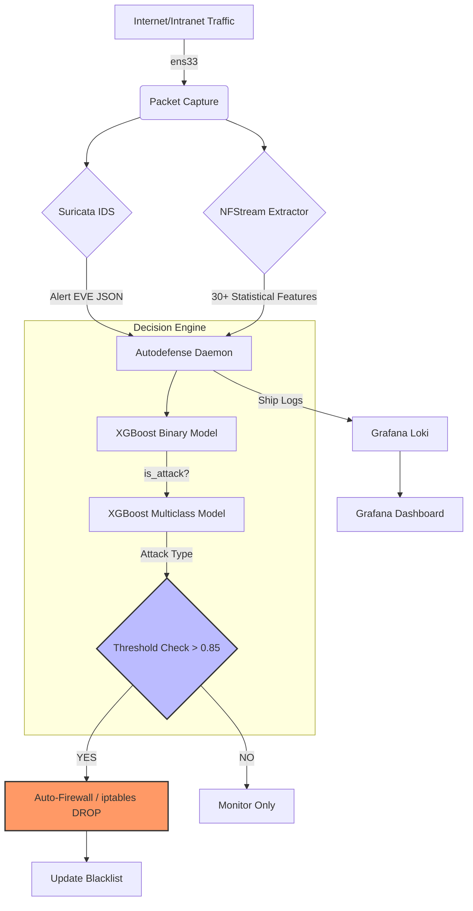

# IDPS - Machine Learning-Based Intrusion Detection and Prevention System

[](https://www.python.org/)
[](https://xgboost.readthedocs.io/)
[](https://www.docker.com/)
[](https://suricata.io/)
[](https://www.nfstream.org/)

> **Zero-touch Automated Network Defense System** using Machine Learning to detect and prevent network attacks in real-time with ultra-low latency (< 100ms).

---

## Table of Contents
- [Introduction](#introduction)
- [Key Features](#key-features)
- [System Architecture](#system-architecture)
- [Project Structure](#project-structure)
- [Installation & Launch](#installation--launch)
- [Evaluation Results](#evaluation-results)
- [Monitoring with Grafana](#monitoring-with-grafana)
- [License](#license)

---

## Introduction

In the modern cybersecurity era, **Zero-day** attacks and sophisticated evasion techniques have made traditional signature-based IDS systems obsolete. This project builds a **Smart IDPS** combining the power of:

- **Suricata**: IDS sensor for detecting known attacks via signature matching.
- **NFStream**: Real-time extraction of 30+ deep statistical network flow features.
- **XGBoost (ML)**: Powerful machine learning model for identifying anomalous behavior and new attacks without signatures.
- **Zero-touch Automation**: Fully automated response process, blocking attacker IPs via `iptables` within milliseconds.

---

## Key Features

### Smart Detection & Prevention
- **Binary Classification**: Accurately separates clean traffic (Benign) from attack traffic.
- **Multi-class Classification**: Identifies 6 common attack types: DoS/DDoS, Brute Force, Web Attack, PortScan, Botnet, Infiltration.
- **Zero-touch Response**: Automatically blocks IPs when the suspicious level > 85%, requiring no manual intervention.

### Superior Performance
- **Response Time**: Completes the loop from detection to prevention in **< 100ms**.
- **Accuracy**: Detection Rate (Recall) reaches **99.94%** with an ultra-low False Positive Rate (FPR) of **0.106%**.

---

## System Architecture

The system is designed with a Microservices architecture, fully containerized in Docker for isolation and easy deployment.

### Data Flow Diagram



---

## Project Structure

```text
IDPS/
├── docker/                 # Microservices Configuration
│   ├── autodefense/        # Main Processing Engine (Python + ML)
│   ├── grafana/            # Dashboards & Data Sources Configuration
│   ├── suricata/           # IDS Sensor
│   └── docker-compose.yml  # Orchestration file
├── src/                    # Real-time Processing Source Code
│   ├── autodefense_daemon.py # Main daemon operating the system
│   ├── realtime_extractor.py # Network flow feature extraction
│   ├── threat_evaluator.py   # ML-based decision maker
│   ├── auto_firewall.py      # Iptables interaction (Kernel level)
│   └── ip_manager.py         # Blacklist/Whitelist management
├── models/                 # Trained ML Models
│   ├── active_model.pkl    # Binary classification model (Attack/Benign)
│   ├── classification_model.pkl # Multi-class model (Attack Types)
│   ├── label_encoder.pkl   # Attack label decoder
├── configs/                # System Configuration
│   ├── blacklist.json      # Automatically/Manually blocked IPs
│   ├── whitelist.json      # Trusted IPs (Admin, Trusted IPs)
│   └── thresholds.json     # Suspicious level threshold for blocking
└── logs/                   # Activity Logs
    └── suricata/           # IDS Alert logs from Suricata (eve.json)
```

---

## Installation & Launch

### 1. Environment Preparation
```bash
# Update system and install Docker
sudo apt update && sudo apt install -y docker.io docker-compose
sudo systemctl enable --now docker
```

### 2. Download Source & Start
```bash
# Clone the project
git clone https://github.com/DuongMinhTien22ba13297/IDPS.git
cd IDPS/docker

# Build and start the system (Daemon Mode)
docker-compose up -d --build
```

---

## Evaluation Results

The system was trained and tested on the international standard **CIC-IDS-2017** dataset using **SMOTE** for data balancing.

### Model Performance (XGBoost)
| Metric | Value | Notes |
| :--- | :--- | :--- |
| **Detection Rate (Recall)** | **99.94%** | Ultra-high attack detection capability |
| **False Positive Rate** | **0.106%** | Very rare false blocks for legitimate users |
| **F1-Score** | **0.997** | Balance between Precision and Recall |
| **Inference Latency** | **0.73 µs** | Prediction time per packet |

---

## Monitoring with Grafana

The system provides an intuitive monitoring interface via Grafana, allowing administrators to track network status and attack attempts in real-time.

- **Main Dashboard**: Accessible at `http://localhost:3000` with default credentials `admin/admin`.
- **Key Features**:
    - **Flow Rate (per minute)**: Real-time network traffic monitoring chart.
    - **Live Flow Logs**: Detailed logs of active network flows.
    - **Top Source IPs**: List of the most frequent source IP addresses.
    - **Threat Logs (Non-Benign)**: Logs of detected intrusions and threats.
    - **ML Multi-Class Probabilities**: Displays the ML model's classification probabilities for each attack type.
- **Auto-refresh**: The dashboard automatically refreshes every 5 seconds.

---

## License

This project is distributed under the **MIT License**. For details, please see the [LICENSE](../LICENSE) file.

**Contact:**
- **Author**: Duong Minh Tien
- **Project**: [IDPS - Intrusion Detection & Prevention System](https://github.com/DuongMinhTien22ba13297/IDPS)

---
> **Warning**: This system makes direct changes to the host's `iptables` rules. Ensure you have configured `whitelist.json` to avoid blocking yourself during testing.
